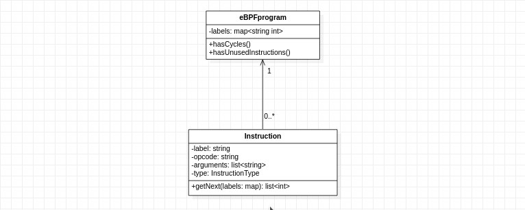
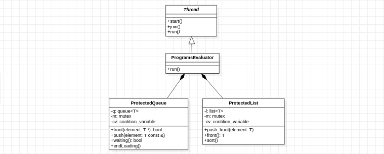

# TP2 - Verificador de programas eBPF simplificado

Pablo Salvador Dimartino - 101231

Taller de Programación I (75.42) - 2º Cuatrimestre 2020

Facultad de Ingeniería

Universidad de Buenos Aires

[Link al repositorio de GitHub](https://github.com/psdimartino/TallerDeProgramacionTP2)

## Estructura general del procesamiento de un programa

Para la resolucion de este trabajo práctico se decidió crear una clase `eBPFprogram` que contenga toda la información del programa a ser procesado. Contiene una lista de instrucciones y  un mapa que asocia los labels con su posicion en la lista:

### Verificación de bucles

Para verificar que el código no tenga bucles se hace un DFS iterativo. Si en dicho recorrio me encuentro con una instrucción en el stack, existe un ciclo.

Esto se realiza utilizando el método `getNext()` de la clase `Instruccion`. El mismo me devuelve la lista de los elementos siguientes a apliar en el `stack`.

### Verificación de instruciones sin utilizar

Esta verificación es similar al algoritmo de verificación de bucles. Realiza un recorrido DFS y al finalizar evalúa si alguna instrucción no fue visitada.

## Solucion a la concurrencia de threads

Para poder procesar archivos al mismo tiempo se crearon distintas clases que permitian realizar dicha acción evitando problemas de *race condition*.

 

### ProtectedQueue 

Esta clase es un *wrapper* de un contentedor del tipo cola, pero realiza la operación `front(T *element)` de forma protegida de *race conditions*.

`front(T *element)` evalúa si la lista esta vacia para luego retirar un elemento. Si otro actor estuviese realizando la misma acción al mismo tiempo, podría remover un elemento luego de dicha evaluacion, quedando invalidada. Es por esto que se decide proteger esta seccion de código.

### ProtectedList

Dicha clase es *wrapper* de uncontentedor del tipo lista. Es neceasrio proteger al método `front()` ya que contiene de forma implicita un `pop()`. Si otro actor obtiene un elemento antes de dicho método podrian duplicarse los elementos. 

También tiene un método que permite el ordenamiento de los elementos que contiene.

### Result

Esta clase existe para asociar a un programa con un archivo y poder almacenar sus resultados. Tambien tiene sobreescritos los operadores `<<` (Para escribir por `std::cout` el resultado) y `<` (Para poder ordenarlos de acuerdo a su nombre)

### Programs evaluator

Esta clase contiene referencias a una lista de resultados y a una cola de programas. Hereda de la clase `thread`. En su unico método `run()` procesa archivos cargandolo a la lista de resultados hasta que la cola este vacía.